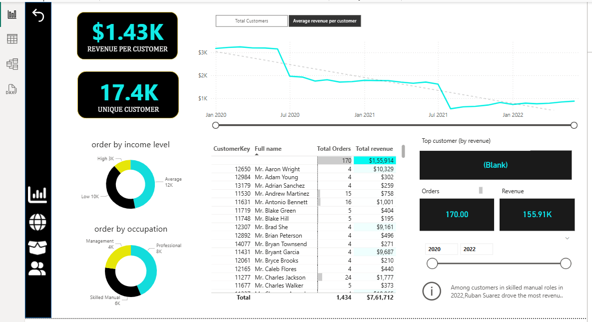
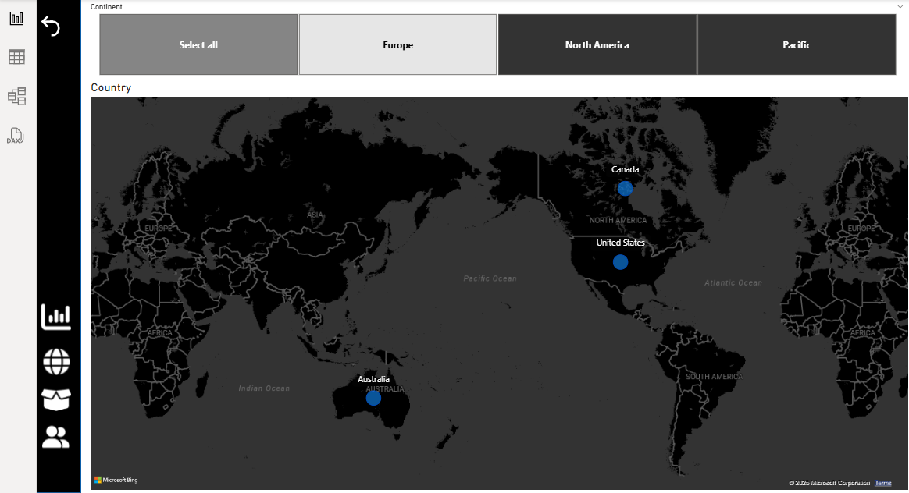
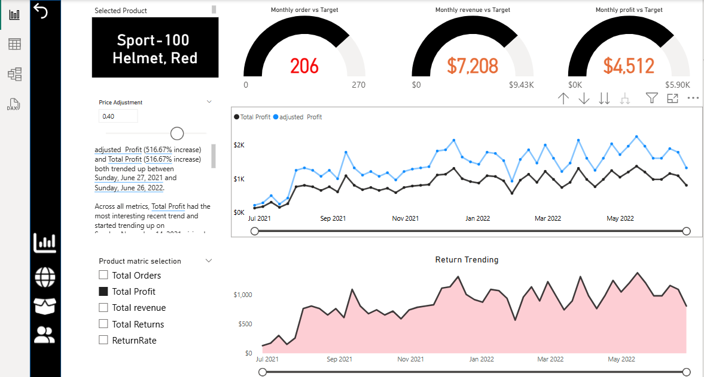
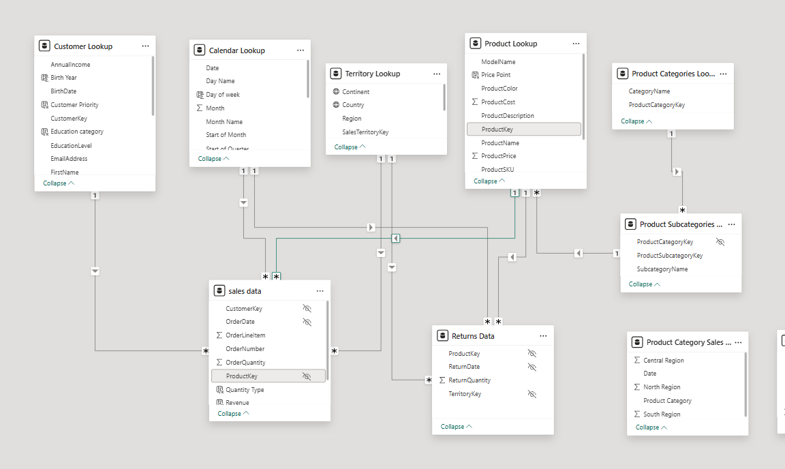

# 🧭 Power BI Adventures Dashboard

Welcome to the **Power BI Adventures Dashboard**, a professional and interactive report built using Power BI.  
This dashboard provides deep insights into the sales, customer trends, and performance of an adventure gear company using real-world-inspired data.

Designed to highlight business intelligence skills — from data cleaning to visualization — this project showcases my ability to turn raw data into compelling insights.

---

## 🌟 Key Features

- 📍 Sales & Profit Analysis by Region and Product Category  
- 📈 Monthly Revenue Trends and Year-over-Year Comparison  
- 👥 Customer Segmentation & Insights  
- 🌍 Geo-based Sales Distribution Map  
- 🔄 Interactive Filters (Region, Product, Customer, Date)

---

## 📸 Dashboard Previews

### 🧍 Customer Overview


### 📈 Executive Summary


### 🌍 Sales by Region (Map View)


### 📦 Product Category Performance


### 🔗 Data Model View


> ✅ All visuals were created in Microsoft Power BI using cleaned and transformed data.

---

## 💾 How to Download & Use the Dashboard

Follow these steps to download and explore the `.pbix` dashboard file:

### 🔽 Step 1: Download the Dashboard File

- Go to this repository: [swathi-gunasekaran05/adventures-dashboard](https://github.com/swathi-gunasekaran05/adventures-dashboard)
- Click the file named **`adventures.pbix`**
- On the top-right corner, click the **`Download`** button (you’ll see a **“Download raw file”** or **“Download”** option)

> 💡 You can also download the entire project by clicking the green **`Code`** button → **`Download ZIP`** → Extract it.

---

### 💻 Step 2: Open in Power BI Desktop

- Install **[Power BI Desktop](https://powerbi.microsoft.com/en-us/desktop/)** if you haven’t already (it’s free)
- Open **Power BI Desktop**
- Click `File` → `Open` → Select the downloaded `adventures.pbix` file

---

### 🔍 Step 3: Explore the Dashboard

- Use the filters (Region, Date, Product, Customer) to slice the data
- Hover over visuals for tooltips
- Review KPIs, category performance, map visuals, and trends

> 🚫 No external data connections required. Everything is self-contained!

---

## 🧠 What You’ll Learn from This Dashboard

- Identify top-performing **regions and categories**
- Track **revenue growth** and seasonal patterns
- Understand **customer purchasing behavior**
- Analyze **monthly performance and profitability**
- View a **clean Power BI data model**

---

## 🛠️ Tools & Technologies Used

| Tool / Language   | Purpose                         |
|-------------------|----------------------------------|
| **Power BI Desktop** | Dashboard creation & visualizations |
| **Power Query**      | Data cleaning & transformation |
| **DAX** (Data Analysis Expressions) | KPIs, calculated fields, dynamic visuals |
| `.pbix` file        | Contains complete interactive report |

---

## 📁 Project Structure

```bash
Powerbi_Adveture_works/
├── adventures.pbix         # Power BI Dashboard file
├── README.md               # Project documentation
├── screenshot.png          # Executive dashboard image
├── Customer.png            # Customer overview
├── Map.png                 # Regional map view
├── Product.png             # Product category visual
└── Relationship.png        # Data model diagram
